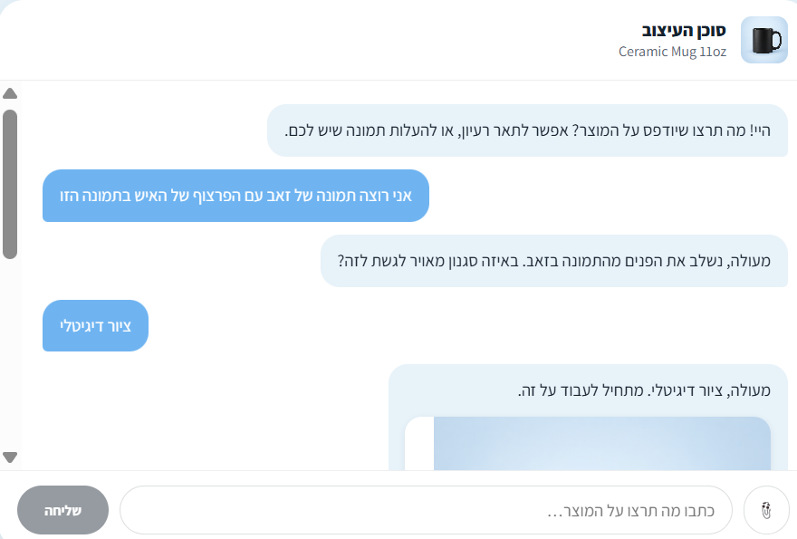
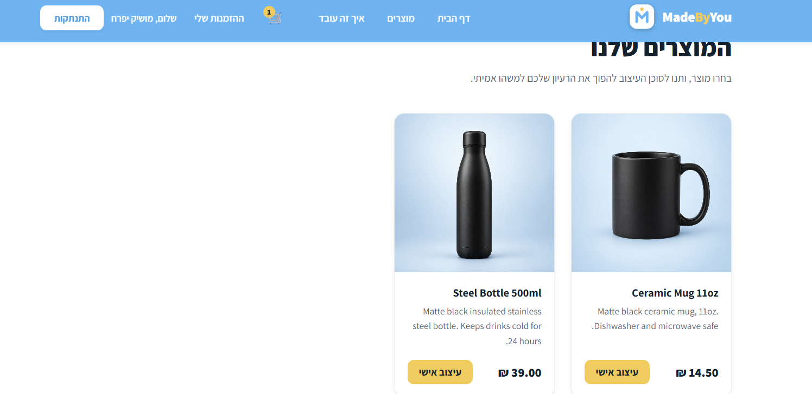
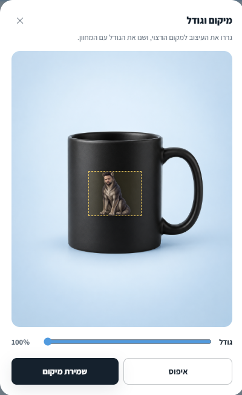
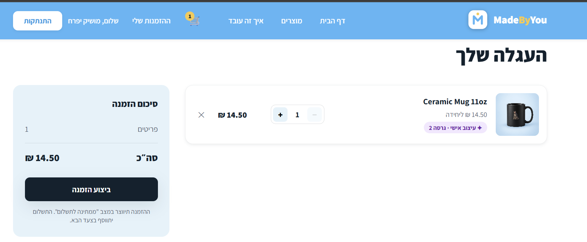

# MadeByYou

A print-on-demand store where you describe the design you want in a chat and
get it back on the product. Built as a full-stack project: React frontend,
Node/Express API, Postgres, and two AI models doing different jobs.



## Features

- Chat-based designer. The agent asks only for what it is missing, and keeps a
  structured brief across the conversation, so "make it darker" still knows
  what it is talking about.
- Three ways to get artwork: generate from a description, upload your own
  image, or upload a photo and have a model transform it.
- Drag to move and resize the design on the product. No image is regenerated.
- Every change is a new version, so you can go back.
- Cart, orders and a sandbox payment flow. The same product with two different
  designs is two separate cart lines.
- Hebrew UI, right to left.

## The routing bit

The agent returns a capability, not a provider name, and the server maps it:

| Request | Capability | Calls a model? |
|---|---|---|
| "a geometric wolf logo in blue" | `TEXT_TO_IMAGE` | yes |
| "turn my photo into a wolf" | `IMAGE_TO_IMAGE` | yes |
| "use my logo, just put it on the mug" | `NONE` | no |

The third case is handled entirely by sharp, so it is free and instant. That
was the point of routing in the first place: not every request needs a model.

The agent also never writes the image prompt. It fills in a `DesignBrief`, and
plain code builds the prompt from it. That keeps prompts reproducible and means
swapping the image provider does not touch the agent.

## How a design gets made

```
"a geometric wolf in blue"
        |
        v  LLMProvider (Claude)
   DesignBrief { subject, style, colorPalette, placement, ... }
        |
        v  PromptBuilder (plain code, deterministic)
   "wolf, geometric low-poly, blue palette, transparent background, no text"
        |
        v  ImageGenProvider / ImageEditProvider / nothing
   artwork.png  (transparent, print resolution)
        |
        v  Compositor (sharp)
   mockup.png   (artwork placed inside the product's print area)
        |
        v  StorageProvider -> Asset rows -> DesignVersion
```

Each version keeps two files: the transparent artwork a printer would use, and
the mockup the customer sees. Because they are separate, moving or resizing a
logo only re-renders the mockup. No model call, no cost.

More detail in [docs/architecture.md](docs/architecture.md).

## Screenshots

| Catalog | Placement editor |
|---|---|
|  |  |



## Stack

Backend: Node 24, TypeScript (strict, ESM), Express 5, Postgres 17, Prisma 7,
Zod, sharp, pino, Argon2id, JWT via jose.

Frontend: React 19, TypeScript, Vite, React Router 7, plain CSS with tokens.

AI: Claude runs the conversation. OpenAI `gpt-image-2.5-flare` generates and
edits images.

Infra: Docker Compose for Postgres. Files go to local disk behind a
`StorageProvider` interface, so S3 is a new implementation rather than a
rewrite.

## Running it

Node 24+ and Docker.

```bash
docker compose up -d

cd apps/api
cp .env.example .env
npm install
npx prisma migrate deploy
npx prisma db seed
npm run dev          # http://localhost:3000

cd ../web
npm install
npm run dev          # http://localhost:5173
```

Environment:

| Variable | Notes |
|---|---|
| `DATABASE_URL` | Postgres connection string |
| `JWT_SECRET` | 32+ chars |
| `IMAGE_PROVIDER` | `mock` or `openai` |
| `OPENAI_API_KEY` | only needed when `IMAGE_PROVIDER=openai` |
| `IMAGE_QUALITY` | `low` to `max`. `low` is about $0.006 per image |

With `IMAGE_PROVIDER=mock` the whole thing runs with no API keys. The mock
returns real transparent PNGs, so the pipeline still works end to end.

## Some decisions worth calling out

Written up with their trade-offs in [docs/adr](docs/adr):

- Money is `Decimal(10,2)` in Postgres and a decimal string over the wire.
  Floats never touch it.
- The agent returns structured output rather than calling a tool. One request
  per generation instead of two, and the server decides whether to act on it.
- Ownership is part of the query. User-scoped reads and writes filter by
  `userId` in the `WHERE` clause instead of checking after fetching.
- Uploads are decoded and re-encoded rather than inspected, which also drops
  EXIF including GPS.
- Cart lines use a computed `lineKey` because Postgres treats every NULL in a
  unique index as distinct, which breaks the obvious constraint.
- Model output is validated with Zod and retried once, the same way request
  bodies and env vars are validated.

## Known gaps

- Image generation is synchronous. A request blocks for 10 to 25 seconds.
  Moving it behind a queue with `202 Accepted` and polling is the next step.
- No moderation on uploaded images.
- Not deployed yet. The target is ECS/Fargate, RDS and S3 behind CloudFront,
  which is why the external dependencies already sit behind interfaces.
