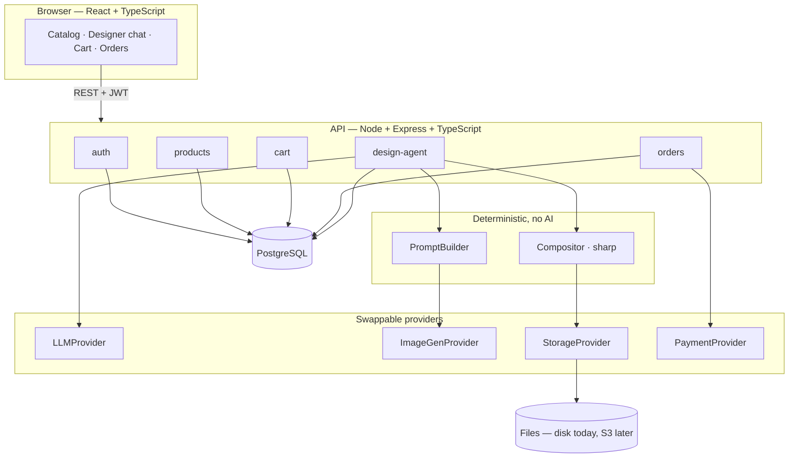

# Architecture

MadeByYou is a print-on-demand store where the design itself is produced in a
conversation. A customer picks a product, describes what they want, and an
agent turns that into a printable design and a product mockup.

## System overview



## The design pipeline

A user message becomes a design version like this:

```
"a geometric wolf in blue"
        │
        ▼  LLMProvider — the only step that uses a model for language
   DesignBrief { subject, style, colorPalette, placement, … }
        │
        ▼  PromptBuilder — ordinary code, deterministic
   "wolf, geometric low-poly, blue palette, transparent background, no text"
        │
        ▼  ImageGenProvider (capability: TEXT_TO_IMAGE)
   artwork.png  — transparent, print resolution
        │
        ▼  Compositor (sharp) — no AI
   mockup.png   — artwork placed inside the product's print area
        │
        ▼  StorageProvider → Asset rows → DesignVersion
```

### Two artefacts per version, on purpose

| Artefact | What it is | Who needs it |
|---|---|---|
| `artwork` | transparent PNG, product-independent | the printer |
| `mockup`  | artwork composited onto the product | the customer |

Keeping them separate is what makes three later features nearly free:

- **Repositioning** a logo re-renders only the mockup — no model call.
- **Matching products** put the same artwork on a different product.
- **Swapping the image provider** changes one file; nothing downstream moves.

## Layering rules

1. **The agent declares intent; the server decides and executes.** The model
   returns `status` and `capability`; the server validates the brief and runs
   the pipeline. A model is never trusted to trigger side effects directly.
2. **Anything crossing a boundary is validated with Zod** — request bodies,
   environment variables, JSON columns, and model output alike.
3. **Ownership lives in the query.** Every user-scoped read and write filters
   by `userId` inside the `WHERE` clause rather than checking after fetching.
4. **Slow work happens outside transactions.** Model calls, image work and file
   writes all complete before any database transaction opens.

## Decision records

See [`docs/adr/`](./adr) — each file records one decision, why it was taken,
and what it costs.
